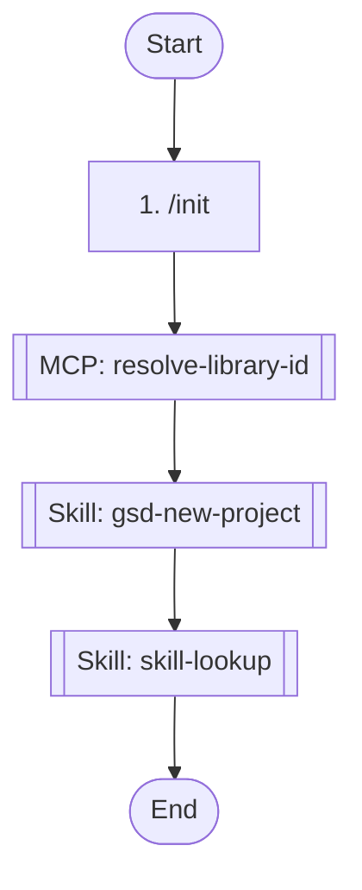

## Workflow Execution Guide

Follow the Mermaid flowchart above to execute the workflow. Each node type has specific execution methods as described below.

### Execution Methods by Node Type

- **Rectangle nodes (Sub-Agent: ...)**: Execute Sub-Agents
- **Diamond nodes (AskUserQuestion:...)**: Use the AskUserQuestion tool to prompt the user and branch based on their response
- **Diamond nodes (Branch/Switch:...)**: Automatically branch based on the results of previous processing (see details section)
- **Rectangle nodes (Prompt nodes)**: Execute the prompts described in the details section below

## Skill Nodes

#### skill-1775007042958(skill-lookup)

- **Prompt**: skill "skill-lookup" "Find the appropriate skill for continuous use this run"

#### skill-1775007625044(gsd-new-project)

- **Prompt**: skill "gsd-new-project"

## MCP Tool Nodes

#### mcp-1775007205350(resolve-library-id) - AI Parameter Config Mode

<!-- MCP_NODE_METADATA: {"mode":"aiParameterConfig","serverId":"context7","toolName":"resolve-library-id","userIntent":"make a knowledge base of this projects codebase","parameterSchema":[{"name":"query","type":"string","required":true,"description":"The question or task you need help with. This is used to rank library results by relevance to what the user is trying to accomplish. The query is sent to the Context7 API for processing. Do not include any sensitive or confidential information such as API keys, passwords, credentials, personal data, or proprietary code in your query."},{"name":"libraryName","type":"string","required":true,"description":"Library name to search for and retrieve a Context7-compatible library ID."}]} -->

**Description**: Resolves a package/product name to a Context7-compatible library ID and returns matching libraries.

You MUST call this function before 'Query Documentation' tool to obtain a valid Context7-compatible library ID UNLESS the user explicitly provides a library ID in the format '/org/project' or '/org/project/version' in their query.

Each result includes:
- Library ID: Context7-compatible identifier (format: /org/project)
- Name: Library or package name
- Description: Short summary
- Code Snippets: Number of available code examples
- Source Reputation: Authority indicator (High, Medium, Low, or Unknown)
- Benchmark Score: Quality indicator (100 is the highest score)
- Versions: List of versions if available. Use one of those versions if the user provides a version in their query. The format of the version is /org/project/version.

For best results, select libraries based on name match, source reputation, snippet coverage, benchmark score, and relevance to your use case.

Selection Process:
1. Analyze the query to understand what library/package the user is looking for
2. Return the most relevant match based on:
- Name similarity to the query (exact matches prioritized)
- Description relevance to the query's intent
- Documentation coverage (prioritize libraries with higher Code Snippet counts)
- Source reputation (consider libraries with High or Medium reputation more authoritative)
- Benchmark Score: Quality indicator (100 is the highest score)

Response Format:
- Return the selected library ID in a clearly marked section
- Provide a brief explanation for why this library was chosen
- If multiple good matches exist, acknowledge this but proceed with the most relevant one
- If no good matches exist, clearly state this and suggest query refinements

For ambiguous queries, request clarification before proceeding with a best-guess match.

IMPORTANT: Do not call this tool more than 3 times per question. If you cannot find what you need after 3 calls, use the best result you have.

**MCP Server**: context7

**Tool Name**: resolve-library-id

**Validation Status**: valid

**User Intent (Natural Language Parameter Description)**:

```
make a knowledge base of this projects codebase
```

**Parameter Schema** (for AI interpretation):

- `query` (string) (required): The question or task you need help with. This is used to rank library results by relevance to what the user is trying to accomplish. The query is sent to the Context7 API for processing. Do not include any sensitive or confidential information such as API keys, passwords, credentials, personal data, or proprietary code in your query.
- `libraryName` (string) (required): Library name to search for and retrieve a Context7-compatible library ID.

**Execution Method**:

Claude Code should interpret the natural language description above and set appropriate parameter values based on the parameter schema. Use your best judgment to map the user intent to concrete parameter values that satisfy the constraints.

### Prompt Node Details

#### prompt-1775005816205(1. /init)

```
1. /init
2. git clone "https://github.com/ktg-one/mcp-webdev"
3. npx in-memoria server
4. Read ONBOARD.md
5. sign contract

```
